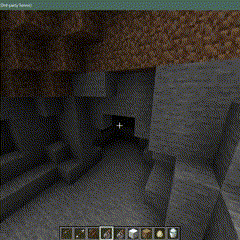
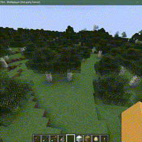

# Spigot Pathfinding Library

The mc-pathfinding library provides pathfinding and animation capabilities for your Minecraft server plugins. This
README will guide you on how to use this library in your server plugins.

Example use case: mc-lightning-strike [repository](https://github.com/btror/mc-lightning-strike)



## Table of Contents

- [Installation](#installation)
- [Usage](#usage)
  - [Pathfinding Methods](#pathfinding-methods)
  - [Examples](#examples)
- [Contributing](#contributing)
- [License](#license)

## Installation

To use this library in your Spigot plugin, you should add it as a dependency. Here's how to do it:

### Option 1 - Add Maven Dependency

1. **Add dependency to dependencies list in pom.xml**:

     ```yml
     <dependency>
        <groupId>com.github.btror</groupId>
        <artifactId>mc-pathfinding</artifactId>
        <version>"insert package version"</version>
        <scope>provided</scope>
     </dependency>
     ```
   
2. **Add repository to repositories list in pom.xml**:

    ```yml
     <repository>
        <id>github</id>
        <url>https://maven.pkg.github.com/btror/mc-pathfinding</url>
     </repository>
     ```

### Option 2 - Locally Install Jar File

1. **Download the Plugin JAR**:

   - Obtain the JAR file from the [Releases](https://github.com/btror/mc-pathfinding/releases) section of this
     repository.

2. **Add the Dependency to Your Project**:

   - Add the mc-pathfinding library as a dependency in your project's plugin.yml:

     ```yml
     depend: [mc-pathfinding]
     ```

   - Add the mc-pathfinding jar file in the server plugin folder.

3. **Reload Your Project**:
   - After adding the dependency, reload your project to ensure that the library is properly integrated.

## Usage

### Pathfinding Methods

The plugin provides various pathfinding algorithms that you can use to create animations in your Minecraft world. These
algorithms can be triggered using the `astarSearch`, `greedyBestFirstSearch`, and `beamSearch` methods with different parameters. You can use
the `search` method to better customize the pathfinding animation.

Here is a list of methods available in the McPathfinding library:

### astarSearch

Performs pathfinding A\* Search with the specified parameters.

| Parameter                       | Description                                                                   |
| ------------------------------- | ----------------------------------------------------------------------------- |
| `JavaPlugin plugin`             | The plugin containing the pathfinding dependency.                             |
| `Location[][][] snapshot`       | 3D array of Location objects representing your Minecraft world's layout.      |
| `Location startLocation`        | The starting Location for the pathfinding operation.                          |
| `Location targetLocation`       | The target Location to reach.                                                 |
| `Material material`             | (optional) A block type that you want to use for visualization.               |
| `Particle particle`             | (optional) A visual particle effect to enhance the animation.                 |
| `boolean tightParticleSpawning` | (optional) Spawn particle effects closer together than a normal block space.  |
| `boolean diagonalMovement`      | (optional) Indicates whether diagonal movement is allowed during pathfinding. |
| `long delay`                    | (optional) The delay (in ticks) before starting the animation.                |
| `long period`                   | (optional) The period (in ticks) at which the animation updates.              |

### beamSearch

Performs pathfinding Beam Search with the specified parameters.

| Parameter                       | Description                                                                        |
| ------------------------------- | ---------------------------------------------------------------------------------- |
| `JavaPlugin plugin`             | The plugin containing the pathfinding dependency.                                  |
| `Location[][][] snapshot`       | 3D array of Location objects representing your Minecraft world's layout.           |
| `Location startLocation`        | The starting Location for the pathfinding operation.                               |
| `Location targetLocation`       | The target Location to reach.                                                      |
| `int beamWidth`                 | The width of the beam to search i.e., the maximum size of the algorithm open list. |
| `Material material`             | (optional) A block type that you want to use for visualization.                    |
| `Particle particle`             | (optional) A visual particle effect to enhance the animation.                      |
| `boolean tightParticleSpawning` | (optional) Spawn particle effects closer together than a normal block space.       |
| `boolean diagonalMovement`      | (optional) Indicates whether diagonal movement is allowed during pathfinding.      |
| `long delay`                    | (optional) The delay (in ticks) before starting the animation.                     |
| `long period`                   | (optional) The period (in ticks) at which the animation updates.                   |

### greedyBestFirstSearch

Performs pathfinding Greedy Best First Search with the specified parameters.

| Parameter                       | Description                                                                   |
| ------------------------------- | ----------------------------------------------------------------------------- |
| `JavaPlugin plugin`             | The plugin containing the pathfinding dependency.                             |
| `Location[][][] snapshot`       | 3D array of Location objects representing your Minecraft world's layout.      |
| `Location startLocation`        | The starting Location for the pathfinding operation.                          |
| `Location targetLocation`       | The target Location to reach.                                                 |
| `Material material`             | (optional) A block type that you want to use for visualization.               |
| `Particle particle`             | (optional) A visual particle effect to enhance the animation.                 |
| `boolean tightParticleSpawning` | (optional) Spawn particle effects closer together than a normal block space.  |
| `boolean diagonalMovement`      | (optional) Indicates whether diagonal movement is allowed during pathfinding. |
| `long delay`                    | (optional) The delay (in ticks) before starting the animation.                |
| `long period`                   | (optional) The period (in ticks) at which the animation updates.              |

### search

Initiates a pathfinding animation with the specified parameters.

| Method                          | Description                                                                                                                        |
| ------------------------------- | ---------------------------------------------------------------------------------------------------------------------------------- |
| `JavaPlugin plugin`             | The plugin containing the pathfinding dependency.                                                                                  |
| `Location[][][] snapshot`       | 3D array of Location objects representing your Minecraft world's layout.                                                           |
| `Location startLocation`        | The starting Location for the pathfinding operation.                                                                               |
| `Location targetLocation`       | The target Location to reach.                                                                                                      |
| `Material material`             | A block type that you want to use for visualization.                                                                               |
| `Particle particle`             | A visual particle effect to enhance the animation.                                                                                 |
| `boolean tightParticleSpawning` | Spawn particle effects closer together than a normal block space.                                                                  |
| `String algorithm`              | The pathfinding algorithm to use (e.g., "astar" or "gbfs").                                                                        |
| `boolean diagonalMovement`      | Indicates whether diagonal movement is allowed during pathfinding.                                                                 |
| `long delay`                    | The delay (in ticks) before starting the animation.                                                                                |
| `long period`                   | The period (in ticks) at which the animation updates.                                                                              |
| `int beamWidth`                 | The width of the beam to search i.e., the maximum size of the algorithm open list. Defaults to 0 for algorithms that don't use it. |

### Examples

You can customize the pathfinding animations by adjusting the method parameters, such as the material, particle, delay,
and period. Experiment with different values to achieve the desired visual effect.

```java
// Examples of a few ways to use the astarSearch and greedyBestFirstSearch methods.
McPathfinding.astarSearch(plugin, snapshot, startLocation, targetLocation, material);
McPathfinding.astarSearch(plugin, snapshot, startLocation, targetLocation, particle, tightParticleSpawning);
McPathfinding.astarSearch(plugin, snapshot, startLocation, targetLocation, material, diagonalMovement);
McPathfinding.greedyBestFirstSearch(plugin, snapshot, startLocation, targetLocation, material, particle, tightParticleSpawning, diagonalMovement);
McPathfinding.greedyBestFirstSearch(plugin, snapshot, startLocation, targetLocation, material, delay, period);
McPathfinding.greedyBestFirstSearch(plugin, snapshot, startLocation, targetLocation, material, particle, tightParticleSpawning, diagonalMovement, delay, period);

// Example of one way to use beamSearch method.
McPathfinding.beamSearch(plugin, snapshot, startLocation, targetLocation, material, beamWidth);

// Example of how to use the search method.
McPathfinding.search(plugin, snapshot, startLocation, targetLocation, material, particle, tightParticleSpawning, algorithm, diagonalMovement, delay, period);
```

Here's a simple example scenario of how the library can be used.

```java
// Create a snapshot of an area in your Minecraft world based on the location of a Player.
Location[][][] snapshot = new Location[11][11][11];

for(int i = 0; i < 11; i++){
        for(int j = 0; j < 11; j++){
                for(int k = 0; k < 11; k++){
                        snapshot[i][j][k] = new Location(
                                player.getLocation().getWorld(),
                                player.getLocation().getX() + i,
                                player.getLocation().getY() + j,
                                player.getLocation().getZ() + k
                        );
                }
        }
}

// Choose a start and target location in the snapshot.
Location snapshotStartLocation = snapshot[10][10][10];
Location snapshotTargetLocation = snapshot[8][7][0];

// Use a pathfinding method to find a path from start to target.
McPathfinding.astarSearch(plugin, snapshot, snapshotStartLocation, snapshotTargetLocation, Material.GOLD_BLOCK, 0, 4);
```



<br>

Feel free to explore more customization options and use different pathfinding methods provided by the plugin to create
engaging animations in your Minecraft server.


## Contributing

We welcome contributions from the community! Whether you want to report a bug, request a feature, or submit a code
improvement, please follow the guidelines in the [CONTRIBUTING.md](https://github.com/btror/mc-pathfinding/blob/main/CONTRIBUTING.md) to make the process smooth and efficient.


## License

This project is licensed under the MIT License. See the LICENSE file for details.

