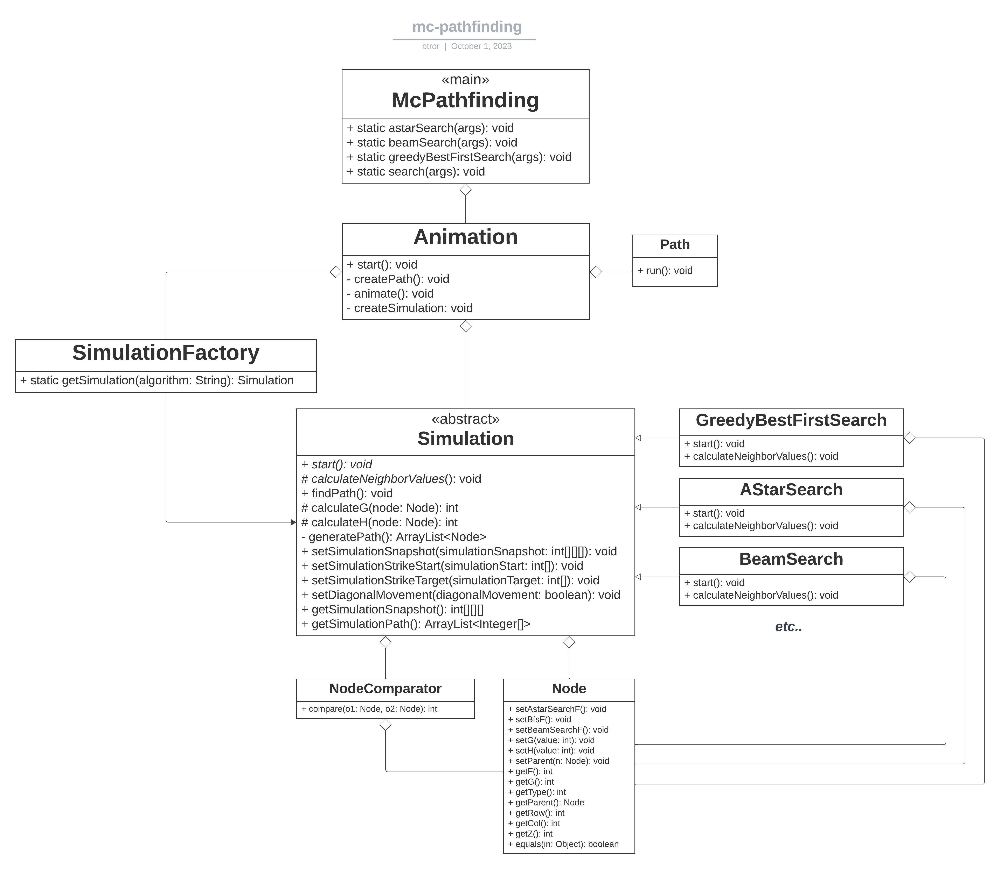

# Spigot Pathfinding Library

The mc-pathfinding library provides pathfinding and animation capabilities for your Minecraft server plugins. This
README will guide you on how to use this library in your server plugins.

Example use case: mc-lightning-strike [repository](https://github.com/btror/mc-lightning-strike/tree/btror)


## Table of Contents

- [Installation](#installation)
- [Usage](#usage)
  - [Pathfinding Methods](#pathfinding-methods)
  - [Examples](#examples)
- [Contributing](#contributing)
  - [Reporting Issues](#reporting-issues)
  - [Code Contributions](#code-contributions)
  - [Coding Guidelines](#coding-guidelines)
  - [Development Environment](#development-environment)
- [Data Model](#data-model)
- [License](#license)

## Installation

To use this library in your Spigot plugin, you should add it as a dependency. Here's how to do it:

1. **Download the Plugin JAR**:

   - Obtain the JAR file from the [Releases](https://github.com/btror/McPathfinding/releases) section of this
     repository.

2. **Add the Dependency to Your Project**:

   - Add the mc-pathfinding library as a dependency in your project's plugin.yml:

     ```yml
     depend: [mc-pathfinding]
     ```

   - Add the mc-pathfinding jar file in the server plugin folder.

3. **Reload Your Project**:
   - After adding the dependency, reload your project to ensure that the library is properly integrated.

## Usage

### Pathfinding Methods

The plugin provides various pathfinding algorithms that you can use to create animations in your Minecraft world. These
algorithms can be triggered using the `astar` and `greedyBestFirstSearch` methods with different parameters. You can use
the `search` method to better customize the pathfinding animation.

Here is a list of methods available in the McPathfinding library:

#### `astar`

Performs A\* pathfinding with the specified parameters.

| Parameter                       | Description                                                                   |
| ------------------------------- | ----------------------------------------------------------------------------- |
| `JavaPlugin plugin`             | The plugin containing the pathfinding dependency.                             |
| `Location[][][] snapshot`       | 3D array of Location objects representing your Minecraft world's layout.      |
| `Location startLocation`        | The starting Location for the pathfinding operation.                          |
| `Location targetLocation`       | The target Location to reach.                                                 |
| `Material material`             | (optional) A block type that you want to use for visualization.               |
| `Particle particle`             | (optional) A visual particle effect to enhance the animation.                 |
| `boolean tightParticleSpawning` | (optional) Spawn particle effects closer together than a normal block space.  |
| `boolean diagonalMovement`      | (optional) Indicates whether diagonal movement is allowed during pathfinding. |
| `long delay`                    | (optional) The delay (in ticks) before starting the animation.                |
| `long period`                   | (optional) The period (in ticks) at which the animation updates.              |

#### `greedyBestFirstSearch`

Performs Greedy Best First Search pathfinding with the specified parameters.

| Parameter                       | Description                                                                   |
| ------------------------------- | ----------------------------------------------------------------------------- |
| `JavaPlugin plugin`             | The plugin containing the pathfinding dependency.                             |
| `Location[][][] snapshot`       | 3D array of Location objects representing your Minecraft world's layout.      |
| `Location startLocation`        | The starting Location for the pathfinding operation.                          |
| `Location targetLocation`       | The target Location to reach.                                                 |
| `Material material`             | (optional) A block type that you want to use for visualization.               |
| `Particle particle`             | (optional) A visual particle effect to enhance the animation.                 |
| `boolean tightParticleSpawning` | (optional) Spawn particle effects closer together than a normal block space.  |
| `boolean diagonalMovement`      | (optional) Indicates whether diagonal movement is allowed during pathfinding. |
| `long delay`                    | (optional) The delay (in ticks) before starting the animation.                |
| `long period`                   | (optional) The period (in ticks) at which the animation updates.              |

#### `search`

Initiates a pathfinding animation with the specified parameters.

| Method                          | Description                                                                  |
| ------------------------------- | ---------------------------------------------------------------------------- |
| `JavaPlugin plugin`             | The plugin containing the pathfinding dependency.                            |
| `Location[][][] snapshot`       | 3D array of Location objects representing your Minecraft world's layout.     |
| `Location startLocation`        | The starting Location for the pathfinding operation.                         |
| `Location targetLocation`       | The target Location to reach.                                                |
| `Material material`             | A block type that you want to use for visualization.                         |
| `Particle particle`             | A visual particle effect to enhance the animation.                           |
| `boolean tightParticleSpawning` | (optional) Spawn particle effects closer together than a normal block space. |
| `String algorithm`              | The pathfinding algorithm to use (e.g., "astar" or "gbfs").                  |
| `boolean diagonalMovement`      | Indicates whether diagonal movement is allowed during pathfinding.           |
| `long delay`                    | The delay (in ticks) before starting the animation.                          |
| `long period`                   | The period (in ticks) at which the animation updates.                        |

### Examples

You can customize the pathfinding animations by adjusting the method parameters, such as the material, particle, delay,
and period. Experiment with different values to achieve the desired visual effect.

```java
// Examples of a few ways to use the astar and greedyBestFirstSearch methods.
McPathfinding.astar(plugin, snapshot, startLocation, targetLocation, material);
McPathfinding.astar(plugin, snapshot, startLocation, targetLocation, particle, tightParticleSpawning);
McPathfinding.astar(plugin, snapshot, startLocation, targetLocation, material, diagonalMovement);
McPathfinding.greedyBestFirstSearch(plugin, snapshot, startLocation, targetLocation, material, particle, tightParticleSpawning, diagonalMovement);
McPathfinding.greedyBestFirstSearch(plugin, snapshot, startLocation, targetLocation, material, delay, period);
McPathfinding.greedyBestFirstSearch(plugin, snapshot, startLocation, targetLocation, material, particle, tightParticleSpawning, diagonalMovement, delay, period);

// Example of how to use the search method.
McPathfinding.search(plugin, snapshot, startLocation, targetLocation, material, particle, tightParticleSpawning, algorithm, diagonalMovement, delay, period);
```

Here's a simple example scenario of how the library can be used.

```java
// Create a snapshot of an area in your Minecraft world based on the location of a Player.
Location[][][] snapshot = new Location[20][20][20];

for(int i = 0; i < 20; i++){
        for(int j = 0; j < 20; j++){
                for(int k = 0; k < 20; k++){
                        snapshot[i][j][k] = new Location(
                                player.getLocation().getWorld(),
                                player.getLocation().getX() + i,
                                player.getLocation().getY() + j,
                                player.getLocation().getZ() + k
                        );
                }
        }
}

// Choose a start and target location in the snapshot.
Location snapshotStartLocation = snapshot[0][0][5];
Location snapshotTargetLocation = snapshot[10][15][8];

// Use a pathfinding method to find a path from start to target. A path of gold blocks with electric spark particle effects will be generated to show where the path is.
McPathfinding.astar(plugin, snapshot, snapshotStartLocation, snapshotTargetLocation, Material.GOLD_BLOCK, Particle.ELECTRIC_SPARK, true, true);
```

Feel free to explore more customization options and use different pathfinding methods provided by the plugin to create
engaging animations in your Minecraft server.

## Data Model

Here's an overview of the key classes and components, along with their roles and relationships.

<details>
<summary>Library Structure</summary>

### `com.github.btror.mcpathfinding`

Main Class `McPathfinding`

- Contains [Pathfinding Methods](#pathfinding-methods) to be used.

### `com.github.btror.mcpathfinding.simulation`

Abstract Class `Simulation`

- Structure for pathfinding algorithm simulations.
- Abstract base class for different pathfinding algorithms.

Class `SimulationFactory`

- Factory class for creating different pathfinding simulations.

### `com.github.btror.mcpathfinding.simulation.pathfinding`

Class `AStar`

- Implementation of the A\* pathfinding algorithm.

Class `GreedyBestFirstSearch`

- Implementation of the Greedy Best-First Search pathfinding algorithm.

### `com.github.btror.mcpathfinding.simulation.util`

Class `Node`

- Represents a node in the pathfinding simulation.
- Stores information about a grid cell, including its position and type.

Class `NodeComparator`

- Implements a comparator for nodes, used for sorting in pathfinding algorithms.

### `com.github.btror.mcpathfinding.animation`

Class `Animation`

- Manages the visualization of the pathfinding process in Minecraft.
- Animates the pathfinding steps, including block changes and particle effects.

</details>

<details>
<summary>UML Diagram</summary>
<br>

[Lucidchart link](https://lucid.app/lucidchart/ff59dc30-19c4-4c85-8b49-0015e833c6c8/edit?viewport_loc=-1711%2C-1383%2C4042%2C2110%2C0_0&invitationId=inv_5760d042-41fd-4531-af6a-7d3142470512)


</details>

## Contributing

We welcome contributions from the community! Whether you want to report a bug, request a feature, or submit a code
improvement, please follow these guidelines to make the process smooth and efficient.

### Reporting Issues

If you encounter a bug, have a feature request, or have questions about the project, please open an issue on our GitHub
repository. When reporting an issue, be sure to:

- Provide a descriptive title and clear description of the issue.
- Specify the steps to reproduce the problem, if applicable.
- Include any relevant error messages or screenshots.

### Code Contributions

If you'd like to contribute code to this project, please follow these steps:

1. Fork the repository to your GitHub account.
2. Clone the forked repository to your local machine:

   ```bash
   git clone https://github.com/your-username/repository-name.git
   ```

3. Create a new branch for your feature or bug fix:

   ```bash
   git checkout -b feature-or-bug-fix-name
   ```

4. Make your changes and commit them:

   ```bash
   git commit -m "Description of your changes"
   ```

5. Push your changes to your GitHub fork:

   ```bash
   git push origin feature-or-bug-fix-name
   ```

6. Create a pull request (PR) from your fork to the main repository.

7. In your PR, provide a detailed description of your changes, why they are necessary, and any relevant information.

8. Ensure your code follows our coding conventions and standards.

9. Be responsive to feedback and be willing to make changes if necessary.

### Coding Guidelines

Please adhere to our coding guidelines and style conventions when contributing code. You can find our coding guidelines
in the [CONTRIBUTING.md](https://github.com/btror/mc-pathfinding/blob/main/CONTRIBUTING.md) file in the repository.

### Development Environment

To set up a development environment for this project, follow these steps:

1. Clone the repository to your local machine (if you haven't already, see "Code Contributions" above).
2. Install the required dependencies (if any). You can find instructions in the project's README or documentation.
3. Configure any environment variables, secrets, or configuration files as needed.
4. Run the project locally to test your changes.

## License

This project is licensed under the MIT License. See the LICENSE file for details.
